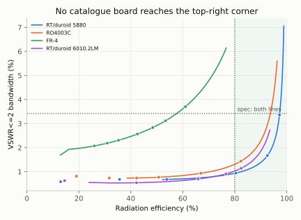
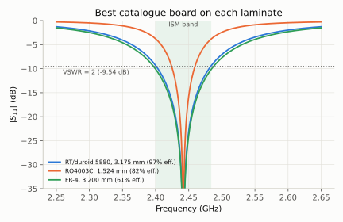
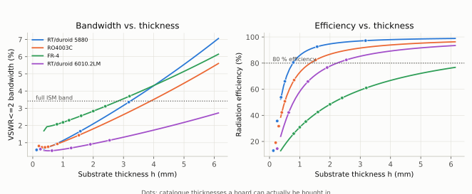
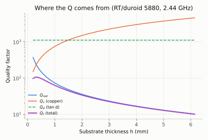
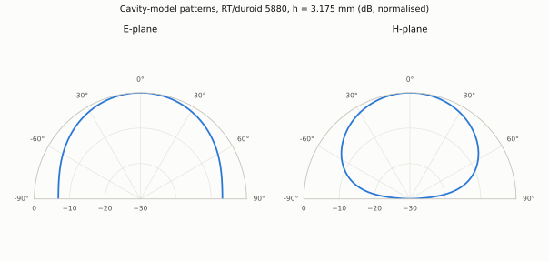

# Microstrip Patch Antenna Synthesis and Laminate Trade-off Study

Can a single rectangular microstrip patch cover the whole 2.4 GHz ISM band
(2400 to 2483.5 MHz) at VSWR ≤ 2 while radiating at least 80 % of the power
it accepts, on a laminate you can actually buy? This repository answers that
with the analytical transmission-line / cavity model of the patch, checked
number for number against the worked examples in Balanis' *Antenna Theory*.

[](https://github.com/fatinnihal532-hub/microstrip-patch-synthesis/actions/workflows/ci.yml)
[](https://colab.research.google.com/github/fatinnihal532-hub/microstrip-patch-synthesis/blob/main/run_in_colab.ipynb)

<picture>
  <source media="(prefers-color-scheme: dark)" srcset="results/bandwidth_vs_efficiency_dark.svg">
  
</picture>

**Answer: no catalogue board does it.** The closest, 3.175 mm RT/duroid 5880,
radiates 97 % of its input power but reaches 3.36 % bandwidth against the
3.42 % the band needs. The only board that clears the bandwidth, 3.2 mm FR-4,
does so at 61 % efficiency: its extra bandwidth is power dissipated in the
laminate, not radiated. Covering the band properly needs a lower-permittivity
or thicker dielectric (foam or air), or a bandwidth-enhancement geometry,
which is where commercial 2.4 GHz patch designs go.

**This is an analytical model, not a full-wave simulation.** No HFSS, CST,
openEMS or FDTD run produced any number here. Every figure comes from the
closed-form equations in `src/patch.py`, evaluated in Python.

## Problem statement

The first design decision for a patch antenna is the laminate and its
thickness, and it fixes almost everything that follows. Low permittivity and
thick substrates radiate well and give bandwidth, but make a large patch;
high permittivity shrinks the patch but stores more energy under it, which
narrows the bandwidth; thin boards lose efficiency to the copper; lossy
boards appear to gain bandwidth by dissipating power. Textbooks give each
effect separately. This project puts them in one model and asks a concrete
question: which laminate and thickness meet a real band and efficiency
specification, and what does each alternative cost?

## Motivation

My HFSS coursework designed one patch at 2.83 GHz on one substrate. That
answers "does this design work?" but not "why this substrate?" or "what else
could have been used?". This project is the analytical counterpart: a model
light enough to evaluate every laminate and thickness in seconds, validated
against a textbook rather than trusted, and honest about the effects it
leaves out.

## Objectives

1. Implement the Balanis Chapter 14 synthesis and analysis of a rectangular
   patch (width, effective permittivity, fringing extension, length, slot
   conductances, input resistance, inset feed, directivity) and reproduce the
   book's worked Examples 14.1, 14.2 and 14.3.
2. Derive radiation, conductor and dielectric Q from the same cavity fields,
   and from them radiation efficiency, bandwidth and the S11 response.
3. Evaluate four real laminates over the usual thickness range, and every
   catalogue thickness a supplier stocks, against the 2.4 GHz ISM band.
4. State the result, and the reason behind it, in a form an engineer could
   act on.

## Technical background

A patch over a ground plane is a leaky resonant cavity. The dominant TM010
mode stores energy in the dielectric under the patch and leaks it from the
two radiating edges, which behave like slots of width W separated by the
patch length. The ratio of stored to radiated energy is the radiation Q,
and bandwidth is inversely proportional to the total Q. Any path that removes
energy without radiating it (copper loss, dielectric loss) lowers the total
Q too, so it widens the bandwidth while lowering efficiency. That coupling
between bandwidth and loss is the central point of this study.

## Methodology (full derivations in `docs/methodology.md`)

| Quantity | Model | Source |
|---|---|---|
| W, ε_eff, ΔL, L | Closed-form synthesis | Balanis (14-6), (14-1), (14-2), (14-7) |
| G1, G12 | Slot conductance integrals, adaptive quadrature | (14-12), (14-18a) |
| R_in, inset depth y0 | Two coupled slots; cos² inset law | (14-17), (14-20a) |
| Directivity | Full two-slot pattern integral (14-55); array-factor form (14-56) also checked | (14-52) to (14-56) |
| E/H-plane patterns | Cavity model | (14-43), (14-44) |
| Q_rad | Derived: ω·W_stored / P_rad for the TM010 fields, using the same P_rad that defines R_in | `docs/methodology.md` §4 |
| Q_c, Q_d | h·√(πfμ₀σ), 1/tanδ | (14-88a), (14-88b) |
| S11(f), bandwidth | Parallel-RLC resonance at the feed; bandwidth read numerically from \|S11\| = 1/3 | derived |

## System architecture

```
substrates.py     laminate catalogue: eps_r, tan(delta), stocked thicknesses
      |
patch.py          synthesis -> conductances -> R_in, inset -> directivity,
                  patterns -> Q_rad, Q_c, Q_d -> efficiency, S11, bandwidth
      |
design_space.py   thickness sweep, thinnest board meeting the bandwidth
                  (brentq), every catalogue board against the full spec
      |
make_figures.py   every figure and CSV in results/
verify.py         12 checks: Balanis Examples 14.1-14.3 plus internal consistency
```

## Validation against Balanis

`verify.py` reproduces the book's worked examples (RT/duroid 5880,
ε_r = 2.2, h = 0.1588 cm, 10 GHz):

| Quantity | Balanis | This code |
|---|---|---|
| W (Ex. 14.1) | 1.186 cm | 1.1850 cm |
| ε_eff | 1.972 | 1.9715 |
| ΔL | 0.081 cm | 0.0811 cm |
| L | 0.906 cm | 0.9053 cm |
| G1 (Ex. 14.2) | 0.00157 S | 0.001573 S |
| G12 | 6.1683 × 10⁻⁴ S | 6.16833 × 10⁻⁴ S |
| R_in | 228.3508 Ω | 228.3508 Ω |
| Inset y0 for 50 Ω | 0.3126 cm | 0.3126 cm |
| I1, D0 (Ex. 14.3) | 1.863, 3.312 | 1.8627, 3.3124 |
| D2 by (14-56) | 4.7584 | 4.7585 |
| D2 by (14-55) | 5.3873 | 5.4365 |

W and L differ by 0.08 % because the book rounds c to 3 × 10⁸ m/s. The one
larger difference, D2 by (14-55), was investigated rather than tolerated:
adaptive quadrature and an independent 2000 × 2000 grid agree on
I2 = 3.56550 to twelve digits, whereas the book's I2 = 3.598 corresponds to
L_e = 1.057 cm instead of the stated 1.068 cm, which points to a coarser
numerical integration in the text.

## Experimental setup

- Design frequency: 2.44175 GHz, the centre of the 2400 to 2483.5 MHz band.
- Required VSWR ≤ 2 bandwidth: 83.5 / 2441.75 = 3.42 %.
- Required radiation efficiency: ≥ 80 %.
- Laminates (nominal datasheet ε_r, tanδ): RT/duroid 5880 (2.20, 0.0009),
  RO4003C (3.55 design Dk, 0.0027), FR-4 (4.4, 0.020), RT/duroid 6010.2LM
  (10.2, 0.0023).
- Thickness: 60 points from 0.003 λ0 to 0.05 λ0 (0.37 to 6.1 mm), the range
  Balanis gives as usual for patches, plus every stocked catalogue thickness.
- Copper conductors, σ = 5.8 × 10⁷ S/m; 50 Ω feed.

## Results

**1. Thinnest board that meets the bandwidth, as a free variable:**

| Laminate | h needed | Efficiency | Gain | Patch area | Meets both? |
|---|---|---|---|---|---|
| RT/duroid 5880 | 3.23 mm | 97.3 % | 7.2 dBi | 1918 mm² | yes |
| RO4003C | 3.90 mm | 93.7 % | 6.2 dBi | 1260 mm² | yes |
| FR-4 | 2.82 mm | 57.7 % | 3.7 dBi | 1061 mm² | no, efficiency |
| RT/duroid 6010.2LM | not reachable below 0.05 λ0 | – | – | – | no |

**2. The boards that can actually be bought:** neither 3.23 mm nor 3.90 mm is
a stocked thickness. Evaluating every catalogue board
(`results/catalogue_boards.csv`):

| Board | Bandwidth | Efficiency | Gain | Area | Verdict |
|---|---|---|---|---|---|
| RT/duroid 5880, 3.175 mm | 3.36 % | 97.2 % | 7.2 dBi | 1920 mm² | misses bandwidth by 0.06 points |
| RO4003C, 1.524 mm (thickest) | 1.44 % | 82.4 % | 5.5 dBi | 1309 mm² | misses bandwidth |
| FR-4, 3.2 mm | 3.70 % | 61.0 % | 4.0 dBi | 1054 mm² | bandwidth only, through loss |
| RT/duroid 6010.2LM, 2.54 mm | 1.14 % | 82.5 % | 4.6 dBi | 484 mm² | misses bandwidth |

<picture>
  <source media="(prefers-color-scheme: dark)" srcset="results/s11_best_boards_dark.svg">
  
</picture>

**3. Where FR-4's bandwidth comes from.** With its loss tangent set to zero,
the same 3.2 mm FR-4 patch has only 2.29 % bandwidth. The extra 1.4
percentage points exist because 39 % of the accepted power heats the board.

<picture>
  <source media="(prefers-color-scheme: dark)" srcset="results/bandwidth_efficiency_vs_h_dark.svg">
  
</picture>

**4. Why thin boards are inefficient.** Q_rad falls roughly as 1/h while
Q_c rises as h. On RT/duroid 5880 the two cross at h = 0.32 mm; below that
the copper, not radiation, sets the Q, and efficiency collapses (54 % at
0.381 mm, 13 % at 0.127 mm).

<picture>
  <source media="(prefers-color-scheme: dark)" srcset="results/q_breakdown_dark.svg">
  
</picture>

<picture>
  <source media="(prefers-color-scheme: dark)" srcset="results/radiation_patterns_dark.svg">
  
</picture>

Every file in `results/` is generated by CI, not uploaded by hand: on each
push to `main`, GitHub Actions runs `verify.py` and the tests, then
`make_figures.py`, and commits the regenerated `results/`.

## Discussion

The result is a negative one, and it is the useful kind: it tells the
designer to stop searching laminate catalogues. On standard boards, a single
rectangular patch trades bandwidth against efficiency and size, and at
2.4 GHz none of the four laminates lands in the region that meets both
specifications. The 3.175 mm RT/duroid 5880 board comes within 2 % of the
bandwidth target, so relaxing the requirement slightly would be enough in
practice: at VSWR ≤ 2.1 the same board covers 3.61 %, more than the 3.42 %
the band needs. Meeting it properly means changing what sets the Q: a foam or air
dielectric, a stacked parasitic patch, or a slotted (U-slot) or
aperture-coupled geometry. FR-4, the cheap default, only looks competitive
because the model counts its dissipation as bandwidth, which is why
efficiency has to be part of the specification.

## Limitations

1. **Analytical model, not full-wave.** The transmission-line / cavity model
   is a thin-substrate model. Its accuracy degrades toward the thick end of
   the range studied (h approaching 0.05 λ0), which is exactly where the
   interesting designs sit. A full-wave check of the finalist boards is the
   first thing to add.
2. **Surface waves are not modelled.** On thick, high-permittivity boards
   some power is launched into surface waves rather than radiated. The
   efficiencies here are therefore upper bounds, most optimistic for
   RT/duroid 6010.2LM.
3. **Feed reactance is ignored.** The probe or microstrip feed adds
   inductance that shifts the resonance and matters most on thick
   substrates. The S11 curves assume an ideal feed at the inset point.
4. **Nominal laminate data.** ε_r and tanδ are datasheet values, treated as
   exact and frequency-independent. Real lots vary by a few percent in ε_r,
   which alone detunes a patch by about half that percentage.
5. **Finite ground plane and copper roughness** are not modelled; the ground
   is infinite and the copper is smooth.

## Future work

- Validate the four finalist boards in an open-source full-wave solver
  (openEMS) and report the discrepancy against the cavity model as a
  function of h/λ0.
- Add a surface-wave efficiency term, to make the high-permittivity results
  honest at the thick end.
- Add a stacked-patch or foam-substrate model and search for the cheapest
  structure that meets the full ISM specification.
- Add a probe-feed inductance model and re-centre the design for it.

## Reproducibility

```bash
git clone https://github.com/fatinnihal532-hub/microstrip-patch-synthesis.git
cd microstrip-patch-synthesis
pip install -r requirements.txt

python3 verify.py                          # 12 checks, about 1 s
python3 make_figures.py                    # regenerates results/
python3 -m unittest discover -s tests -v   # unit tests
```

Or run it in your browser with nothing installed:

[](https://colab.research.google.com/github/fatinnihal532-hub/microstrip-patch-synthesis/blob/main/run_in_colab.ipynb)

## File layout

```
src/substrates.py     laminate catalogue
src/patch.py          synthesis, conductances, directivity, patterns, Q, S11
src/design_space.py   sweeps, thickness solver, catalogue evaluation, Pareto front
src/plotstyle.py      one look for every figure, light and dark
verify.py             12 checks against Balanis and against the model's closed forms
make_figures.py       regenerates results/
tests/                unit tests
docs/methodology.md   every equation, with its source or derivation
```

## References

1. C. A. Balanis, *Antenna Theory: Analysis and Design*, 3rd ed., Wiley,
   2005, Chapter 14 (Examples 14.1 to 14.3 are the validation targets).
2. Rogers Corporation, RT/duroid 5880, RO4003C and RT/duroid 6010.2LM
   laminate data sheets (nominal dielectric constant, loss tangent and
   stocked thicknesses).

## Author

Fatin Nihal Islam, Electrical & Electronic Engineering, KUET.

## License

MIT
